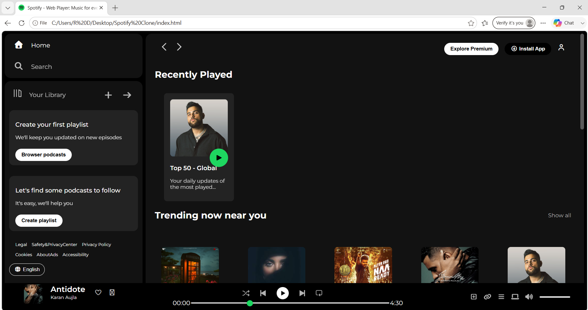
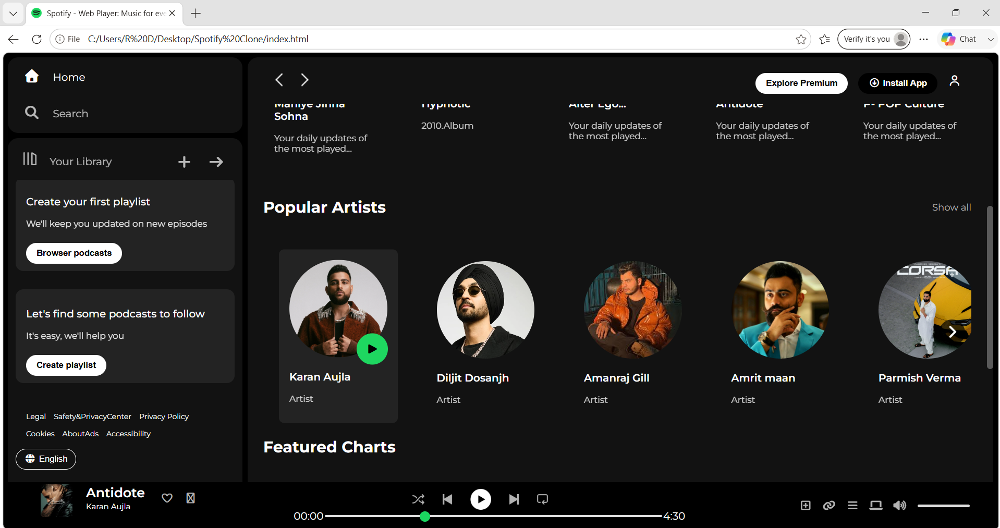
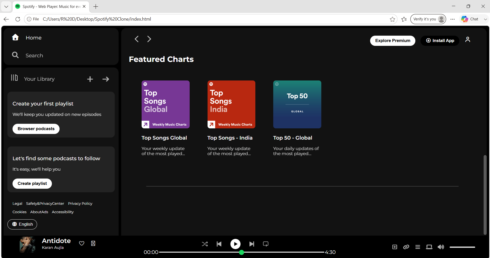
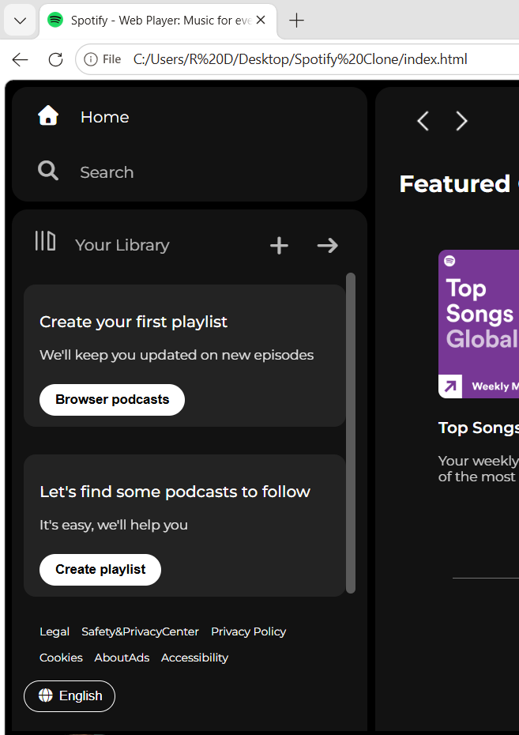

🎧 Spotify Clone
This is a Spotify-inspired web application UI clone built using HTML, CSS, and JavaScript.
It replicates the look and feel of the Spotify web player with a focus on layout design, responsiveness, and user interface structure.

🚀 Features
🎵 Modern music player UI
📂 Sidebar navigation layout
🎧 Playlist-style homepage design
📱 Responsive design for mobile & tablet
🎨 Clean and dark-themed interface (Spotify-like)

🛠️ Tech Stack
HTML5
CSS3 (Flexbox / Grid)
JavaScript (Basic DOM interaction)

📸 Preview

### Screenshot 1

### Screenshot 2

### Screenshot 3

### Screenshot 4

🖥️ Desktop View

Main interface of the Spotify-inspired UI built with responsive layout and sidebar navigation.

📱 Responsive Design

The layout adjusts smoothly for mobile and tablet screens.[working on that ] 

Project Structure
spotify-clone/
│
├── index.html
├── style.css
├── assests
├── images
    ├── Screenshot1.png
    └── Screenshot2.png
    └── Screenshot3.png
    └── Screenshot4.png

What I Learned
Structuring a complex UI using HTML & CSS
Flexbox layout design
Responsive web design principles
DOM manipulation basics in JavaScript
Improving UI consistency and spacing

Live Demo
 https://riya16052616.github.io/spotify-clone/

Future Improvements
Add real audio playback functionality 🎶
Improve animations and transitions
Add user login UI
Connect with a music API

If you like this project

Give it a ⭐ on GitHub!
